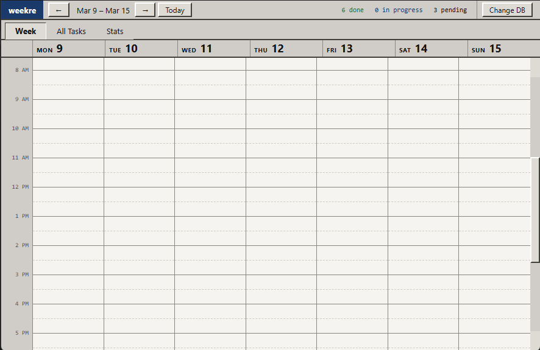
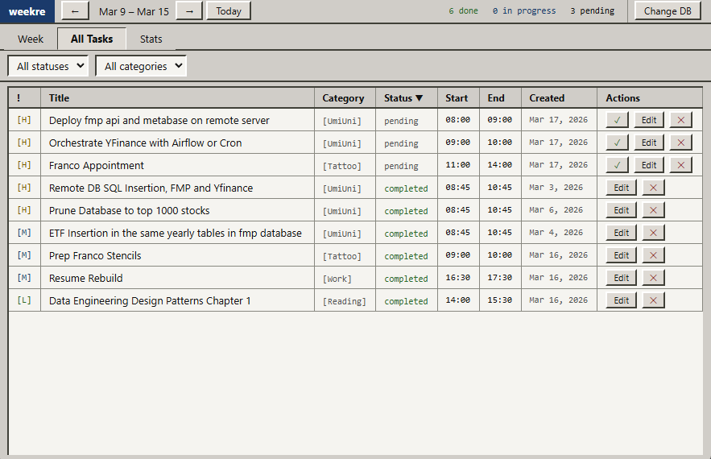
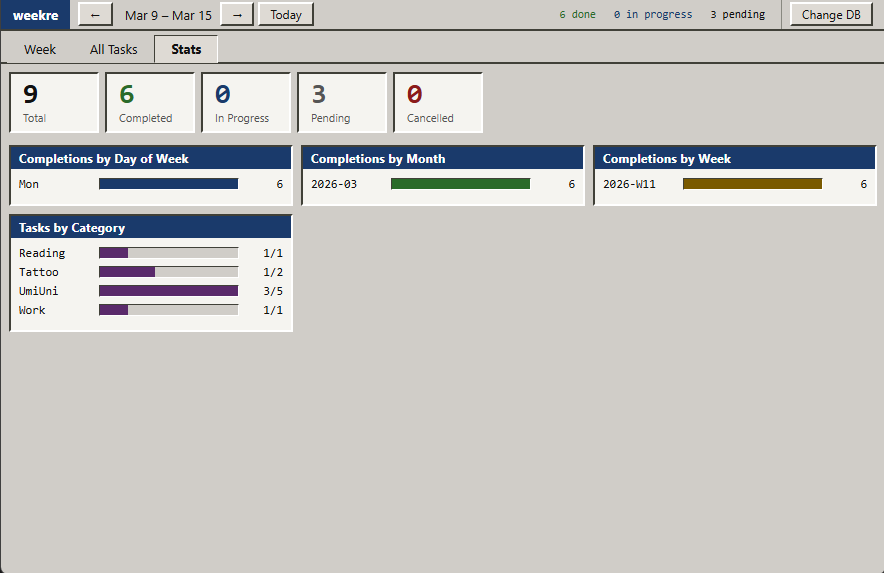

# Weekre
Weekly task tracker with database tracking

## SQLite Integration

This application uses SQLite via javascript and Electron.

This means that all your tasks (completed or otherwise) are stored in a structured dataset, highly queryable.

This allows us to keep track of our tasks in many different ways, but the starting idea is the calendar view, which I find to be the best way for me to view my time.

### Week
---
A view of the 'Week' Tab

### All Tasks
---
A view of the 'All Tasks' Tab

### Stats
---
A view of the 'Stats' Tab

